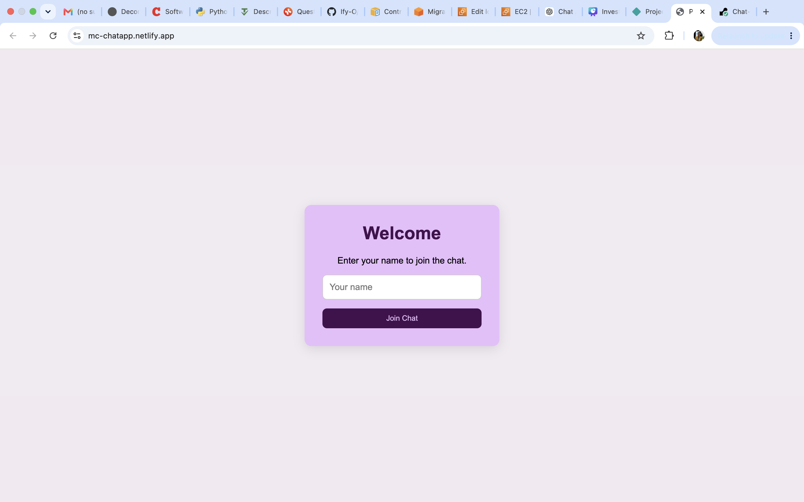
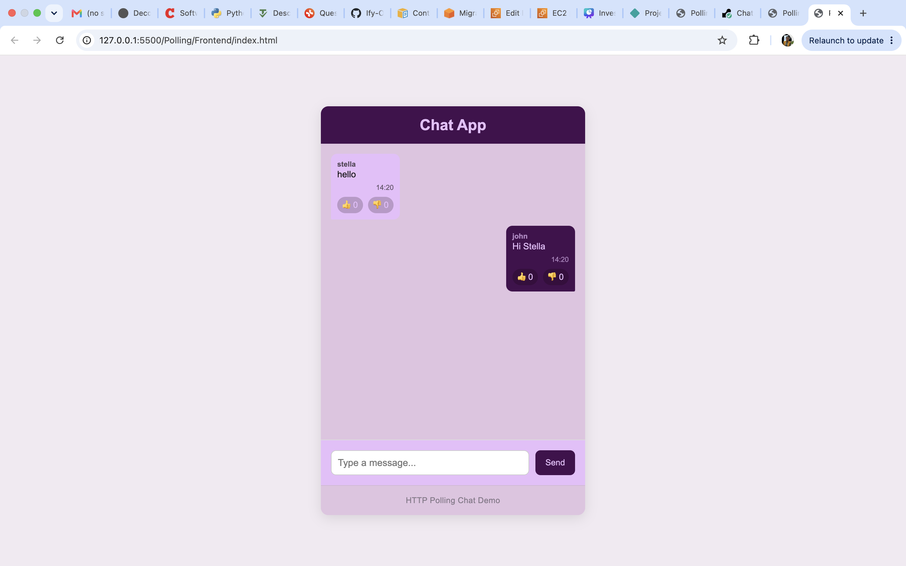

# Polling Chat Application

## Live Demo

- **Frontend:** https://mc-chatapp.netlify.app/
- **Backend:** https://chat-app-backend-gr6s.onrender.com/

## Screenshot

### Join Screen



### Chat Interface



## Overview

This project is a simple real-time chat application built with **Node.js**, **Express**, and **vanilla JavaScript**. It demonstrates how HTTP polling can be used to simulate live updates without using WebSockets.

The application allows multiple users to send messages, view messages from other users, and react to messages with likes or dislikes. The client polls the server every second to retrieve the latest messages.

---

## Features

- Join the chat with a username
- Send messages to the chat
- View messages from all connected users
- Automatic message updates using HTTP polling
- Like and dislike messages
- Responsive user interface

---

## Technologies Used

### Backend

- Node.js
- Express
- CORS
- REST API

### Frontend

- HTML5
- CSS3
- JavaScript (ES6)
- Fetch API

## Deployment

The application is deployed using:

- **Frontend:** Netlify
- **Backend:** Render

This setup separates the static frontend from the Express backend while allowing communication through a REST API.

> **Note:** The backend is hosted on Render's free tier. The first request after inactivity may take 30–60 seconds while the service starts.

---

## Project Structure

```text
Polling/
├── Backend/
│   ├── package.json
│   ├── package-lock.json
│   ├── server.js
│   └── .gitignore
│
├── Frontend/
│   ├── index.html
│   ├── script.js
│   ├── style.css
│   └── README.md
│
└── README.md
```

---

## API Endpoints

| Method | Endpoint                | Description                |
| ------ | ----------------------- | -------------------------- |
| GET    | `/messages`             | Retrieve all chat messages |
| POST   | `/messages`             | Send a new message         |
| POST   | `/messages/:id/like`    | Like a message             |
| POST   | `/messages/:id/dislike` | Dislike a message          |

---

## How Polling Works

Unlike WebSockets, HTTP is a request-response protocol. The server cannot push updates to connected clients, so the frontend periodically requests the latest messages.

```javascript
async function startPolling() {
  await fetchMessages();

  setTimeout(startPolling, 1000);
}
```

Every second the client requests the latest chat messages and updates the interface if new data is available.

---

## Middleware

This project demonstrates several types of Express middleware.

### JSON Middleware

```javascript
app.use(express.json());
```

Parses incoming JSON request bodies.

### CORS Middleware

```javascript
app.use(cors());
```

Allows the frontend and backend to communicate across different origins.

### Custom Logging Middleware

```javascript
app.use((req, res, next) => {
  console.log(`${req.method} ${req.url}`);
  next();
});
```

Logs every incoming request before passing control to the next middleware.

---

## Advantages of HTTP Polling

- Simple to implement
- Uses standard HTTP requests
- Easy to understand for beginners
- Works in all modern browsers

---

## Limitations

- Not true real-time communication
- Sends repeated requests even when no new messages exist
- Less efficient than persistent connections such as WebSockets
- Increased network traffic and server workload

---

## Learning Outcomes

Building this project helped me understand:

- REST API design using Express
- Client-server communication with HTTP
- Express middleware
- Polling as a technique for simulating real-time updates
- Building and consuming API endpoints with the Fetch API

---

## Getting Started

### Install dependencies

```bash
cd backend
npm install
```

### Start the backend

```bash
node server.js
```

### Start the frontend

Open `frontend/index.html` in your browser or serve it using a local development server.

---

## Future Improvements

- Store messages in a database instead of memory
- User authentication
- Message editing and deletion
- Typing indicators
- Read receipts
- Private conversations
- Migration from polling to WebSockets for true real-time communication
